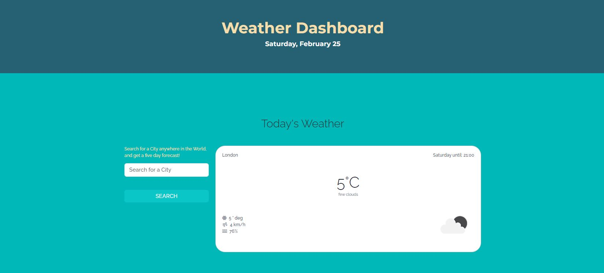
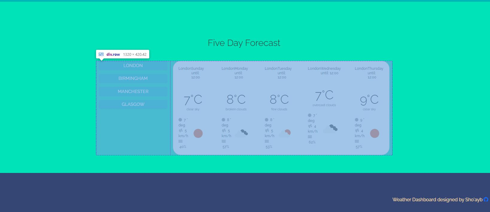

# TABLE OF CONTENTS

[Project Title](#project-title)
[Description](#description)
[Installation](#installation)
[Usage](#usage)
[Guidelines](#guidelines)
[Testing the Application](#testing-the-application)
[Images of the Application](#images-of-the-application)
[Github](#github)
[Deployed Application](#deployed)
[Contact Us](#contact-us)
[Licence](#licence)

## Project Title

Weather Dashboard

## Description

Using the openweather api, the weather dashboard will display the current weatheras well as a five day weather forecast.

## Installation

This is a web base application and requires no installation.

## Usage

Simply open the weather dashboard application in any browser and begin a search for any city to get a five day weather forecast.

## Guidelines

There is currently no scope for contribution on this project. You may clone and do better.

## Testing the Application

To test, search for a city and click search button. A link to your search will be displayed and when you refresh, the search button will persist on the weather dashboard.

Try entering random characters in the search bar to see the error handling message appear.

Try also to search for the same city that has already been search for and check the error handling message that shall appear.

## Images of the application

## Github

https://github.com/Sho-ayb/weather-dashboard-app2

## Deployed

[Weather Dashboard Deployed](https://sho-ayb.github.io/weather-dashboard-app2/)

## Questions

Please contact through Github

## Licence

MIT License

Please click on the badge for more details on the licence.

